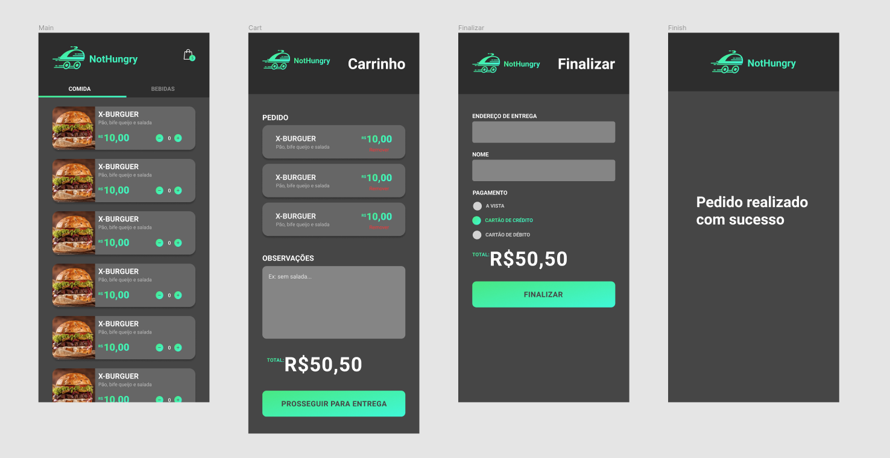

# NotHungry

NotHungry is a delivery system what uses a whatsapp bot api from twilio to return feedbacks to the users



### How to setup

Download the project
`$ git clone https://github.com/cabraljv/nothungry.git`

set your api keys and database credentials in server/.env using the server/.env.example

### How to run

first run the server
```bash
$ cd server
$ yarn dev
``` 

second run the mobile frontend
```bash
$ cd frontend
$ yarn start
``` 
finaly run the admin frontend
```bash
$ cd admin
$ yarn start
``` 

